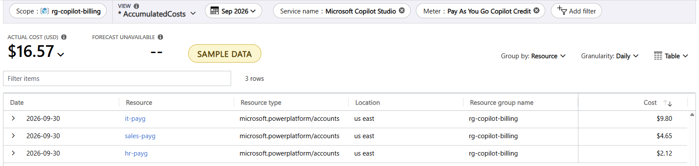

# Copilot Credits report: by agent, user and billing policy

Who used which agent, how many Copilot Credits did it consume, and what did it cost? This tool answers that for **Microsoft Copilot Studio** and **metered Microsoft 365 Copilot Chat agents** when you pay through Power Platform or Microsoft 365 **pay-as-you-go billing policies** linked to an Azure subscription.

| Date | Agent Name | User | Billing Policy | Credits Consumed | Estimated Cost (USD) |
|---|---|---|---|---|---|
| 2026-09-30 | HR Assistant | alice@contoso.com | HR-PAYG | 125 | $1.25 |
| 2026-09-30 | HR Assistant | bob@contoso.com | HR-PAYG | 87 | $0.87 |
| 2026-09-30 | Sales Assistant | john@contoso.com | SALES-PAYG | 320 | $3.20 |
| 2026-09-30 | IT Helpdesk Agent | helpdesk@contoso.com | IT-PAYG | 980 | $9.80 |

*Rows from [samples/sample_report.xlsx](samples/sample_report.xlsx). All sample data is fictitious.*

> Community project, not an official Microsoft tool. It only reads data and changes nothing in your tenant or Azure.

## Why this exists

- **Azure Cost Management has no agent or user detail.** It shows each billing policy as one resource with daily cost per meter. [Microsoft documents this](https://learn.microsoft.com/power-platform/admin/pay-as-you-go-usage-costs).
- **The per-agent consumption API is closed to customers.** In September 2026 Microsoft restricted `GET /licensing/entitlements/MCSMessages/resources` to the Power Platform admin center (PPAC). See [Power-CAT-Copilot-Studio-Kit #855](https://github.com/microsoft/Power-CAT-Copilot-Studio-Kit/issues/855).
- **The user-level endpoints still work.** They are part of the same documented API and return **agent × feature credits for every user, per day**. This tool walks them user by user, adds the billing policy and the user's department, and ties the result back to the Azure bill.

This is what Azure Cost Management shows for Copilot Studio pay-as-you-go: one line per billing policy per day, with no agent or user.



*Sample data. The hr-payg line ($2.12) is alice's $1.25 plus bob's $0.87 from the table above. Azure can't show that split. This report can.*

## What you get

- **An Excel workbook.** All totals and costs are Excel formulas, and the rate per credit is an input cell.
  - **Overview:** credits and cost by product and funding source, plus how much Azure cost could be matched to report rows.
  - **Agent-User Daily:** the table above, plus billed and non-billable credits, environment, funding source, department and allocated Azure cost.
  - **M365 Copilot Chat:** metered agents from the Microsoft 365 Credits report export.
  - **Feature Detail and summaries:** per feature, plus Agent, User and Feature summaries.
  - **Reconciliation:** Azure actual cost per billing policy per day against the report, environment status and tenant capacity.
- **A CSV credits table.** One schema across products, ready for Power BI or Fabric. See [docs/unified-report.md](docs/unified-report.md).
- **Allocated Azure cost.** Each billing policy's actual charge is split across agents and users in proportion to their billed credits.

## Quick start

```powershell
python -m venv .venv
.\.venv\Scripts\python.exe -m pip install -r requirements.txt
```

**Try it without signing in.** This uses the sample Microsoft 365 export, or you can just open `samples/sample_report.xlsx`:

```powershell
.\.venv\Scripts\python.exe copilot_credits_report.py --no-studio --no-azure --no-graph --m365-as-of 2026-09-30 `
  --m365-credits-csv samples\m365_credits_users_and_agents_sample.csv --m365-policy-map samples\m365_policy_map_sample.csv
```

**Run it on your tenant:**

```powershell
.\.venv\Scripts\python.exe copilot_credits_report.py --tenant <tenant-id> --from 2026-09-01 --to 2026-09-30
```

- The script prints a device code. Open https://login.microsoft.com/device, enter the code and sign in as a Power Platform administrator.
- The sign-in page says **"Microsoft Azure CLI"**, because the script uses that public sign-in app by default. Use `--client-id` to supply your own app.
- The sign-in is cached in `~/.copilot-credits-report/`. Delete that folder to sign out.
- On macOS or Linux, use `python3 -m venv .venv` and `.venv/bin/python`.

## Adding Microsoft 365 Copilot Chat metered agents

Microsoft offers no API for metered Copilot Chat usage. Use the report export instead:

1. In the Microsoft 365 admin center, go to **Reports → Usage → Microsoft Copilot → Credits**. Export the **Users and agents** table.
2. Optionally, create a policy map: a CSV of `Billing Policy ID,Billing Policy Name`. Use the name of each policy's Azure resource so costs can be matched. Policy IDs are in **Copilot → Billing & usage → Billing policies → Details**. See `samples/m365_policy_map_sample.csv`.
3. Add these options to the run:

```powershell
--m365-credits-csv users_and_agents.csv --m365-as-of <export date> --m365-policy-map policy_map.csv --subscription <subscription holding the Microsoft 365 billing policies>
```

Things to know about this export:
- **Turn on real names.** Usernames are concealed by default. Turn this off in **Settings → Org settings → Reports**.
- **Windows, not days.** The report only offers rolling 7- or 30-day windows. Export on the same weekday every week so the windows don't overlap (`--m365-window 7`, the default).
- **One policy per user.** Users covered by several billing policies are charged to the oldest one.

## Options

| Option | Purpose |
|---|---|
| `--tenant` | Microsoft Entra tenant ID |
| `--from`, `--to` | Date range (YYYY-MM-DD). Defaults to the 30 days ending yesterday. |
| `--rate` | USD per Copilot Credit. Default 0.01 (list price); set your contract or pre-purchase rate. |
| `--out` | Output `.xlsx`. The credits table `.csv` is written next to it. |
| `--m365-credits-csv`, `--m365-as-of`, `--m365-window`, `--m365-policy-map` | Microsoft 365 Copilot Chat export input |
| `--subscription` | Extra Azure subscription to read costs from (repeatable) |
| `--no-studio`, `--no-azure`, `--no-graph` | Skip a source |
| `--auth azcli` | Use an existing Azure CLI sign-in instead of a device code |

## Permissions

- **Power Platform Administrator**, for licensing, billing policies and environments. Tested with an account that is both Global Administrator and Power Platform Administrator.
- **Cost Management Reader** (or Reader) on the subscriptions that hold the billing policies.
- **Read access to users** in Microsoft Entra ID. Members have this by default.

## Scheduling

Run once a day for a single day that is **two days old**. Licensing snapshots are daily and Azure can lag 24 hours. Save each CSV to one folder; a Power BI folder query merges the files and removes duplicates. See [docs/unified-report.md](docs/unified-report.md).

## Tested end to end

On 1 October 2026, scripted conversations (4 conversations, 7 questions) were run against a Copilot Studio agent in a pay-as-you-go environment of a demo tenant. The report was then checked against Microsoft's licensing data, the environment's pay-as-you-go counter and the Azure bill. All 16 checks passed.

| Source | Result for the day |
|---|---|
| Microsoft licensing data | 16 billed credits: 11 Classic answer + 5 Agent action |
| Environment pay-as-you-go counter | 16 credits |
| Azure Cost Management | 16 credits, $0.16, on the meter **Microsoft Copilot Studio › Pay As You Go Copilot Credit** of the billing policy's resource |
| This report | Same agent, user, billing policy, funding source (PAYG) and credits per feature. All $0.16 allocated, nothing unmatched. |

The agent sent 11 messages, 4 of them answers drawn from its knowledge sources. Microsoft metered 11 Classic answers and one Agent action, with no Generative answers. How each turn is metered is Microsoft's decision, which is why the report uses Microsoft's figures instead of estimating them.

## Limitations

- **Usage without a user can't be split by agent.** This includes some autonomous or event-triggered runs, because the agent listing endpoint is restricted. It appears as Azure cost "not matched to any report row" on the Overview sheet.
- **Developer environments may not be recorded.** In testing, conversations with an agent in a Developer environment never appeared in Microsoft's licensing data. Neither this report nor PPAC can show usage that Microsoft doesn't record.
- **The endpoints may close.** The user-level endpoints are in the [public REST reference](https://learn.microsoft.com/rest/api/power-platform/licensing/entitlement-insight/get-tenant-resource-consumption-by-user), but Microsoft has said this consumption API family is intended for the Power Platform admin center. If they get restricted, the script stops with a clear 403 message. The fallback is **PPAC → Licensing → Copilot Studio → Download report**.
- **Runs need a signed-in admin.** App-only (unattended) access to the licensing endpoints is not confirmed.
- **Microsoft 365 export columns may differ.** The import follows Microsoft's documented column names; open an issue if your export doesn't match.
- **Copilot Cowork and Work IQ are not covered.** They use the Microsoft 365 usage-based billing model; see [docs/unified-report.md](docs/unified-report.md).
- **Three kinds of cost.** "Estimated cost" is billed credits × rate. "Allocated Azure cost" is the actual charge split across rows. Your invoice is the source of truth.

## Documentation

- [docs/how-it-works.md](docs/how-it-works.md): plain-language steps, the systems queried and every API call
- [docs/unified-report.md](docs/unified-report.md): how to build one report across Copilot Studio, Microsoft 365 Copilot, Azure and HR data, with Power BI starter queries

## License and disclaimer

MIT, see [LICENSE](LICENSE). Provided as is, without warranty. This project isn't affiliated with or endorsed by Microsoft. Microsoft, Copilot, Copilot Studio, Power Platform and Azure are trademarks of Microsoft Corporation. Check results against your Azure invoice before using them for chargeback. Contributions and issues are welcome.
